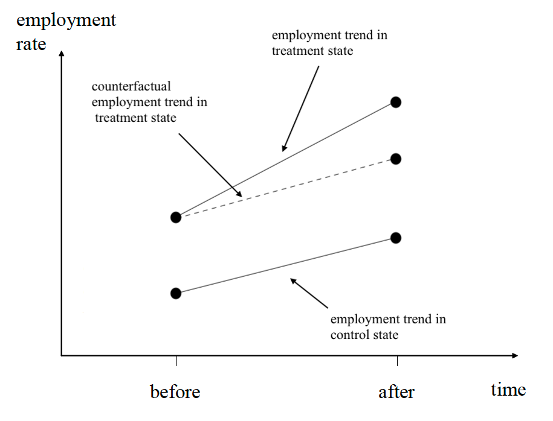
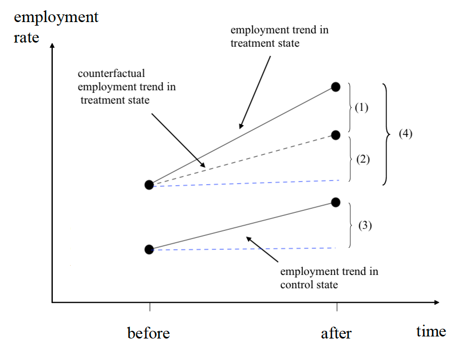
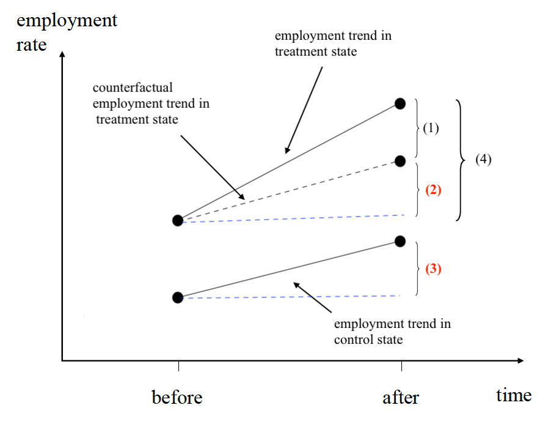
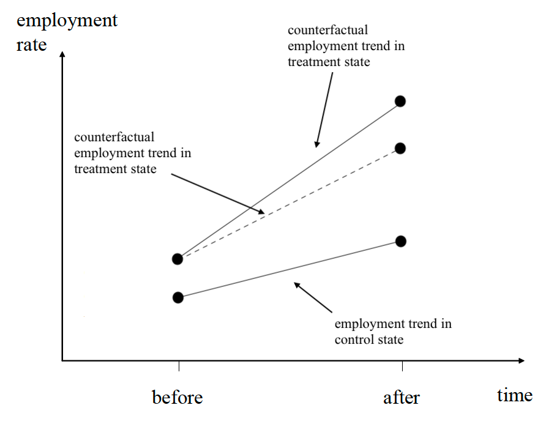

class: middle

```{r, child = '../setup.rmd', cache = FALSE}
```

```{r xaringan-scribble, echo=FALSE}
xaringanExtra::use_scribble()
```


```{r setup, include=FALSE, cache = FALSE}
options(htmltools.dir.version = FALSE)

# /*===== Reference =====*/
suppressMessages(library(RefManageR))

BibOptions(
  check.entries = FALSE,
  bib.style = "authoryear",
  style = "markdown",
  hyperlink = FALSE,
  dashed = TRUE,
  max.names = 2,
  longnamesfirst = FALSE
)
bib <- ReadBib("cite.bib")
```

```{r, include = F, cache = FALSE}
library(data.table)
library(ggplot2)
library(dplyr)
library(gganimate)
library(gifski)
library(gganimate)
# library(learnr)
```

```{r, include = F, eval=F, cache = FALSE}
httpgd::hgd()
httpgd::hgd_browse()
```

```{r xaringan-tachyons, echo=FALSE}
xaringanExtra::use_tachyons()
```

.content-box-green[**A Useful tip:**]

hitting letter "o" key will give you a panel view of the slides

---
class: middle

## Example: The effect of minimum wage on employment

```{r, echo=F, out.width = "80%"}

```

---
class: middle

```{r, echo=F, out.width = "80%"}

```


---
class: middle

```{r, echo=F, out.width = "70%"}

```

.content-box-green[**Question**]

1. Which differences are observed? Which differences are not observed?
2. Which difference is the DID estimand, in other words ATT?
3. In what condition ATT is identified and how ? 


---
class: middle

## Parallel trend assumption

```{r, echo=F, out.width = "60%"}

```

<p style="text-align: center;">If <span style="color:red"><b>(2)</b></span> = <span style="color:red"><b>(3)</b></span> </p>, 

$$ATT = (1) = (4) - \color{red}{(2)} = (4) - \color{red}{(3)}$$

???
+ Change in outcomes for the treatment group before and after if the treatment group had not been treated. 

---
class: middle

## Parallel trend assumption

```{r, echo=F, out.width = "50%"}

```

$$\begin{align*}
ATT 
  &= (2) \\
  &= E[Y_{i,2}(1)Y_{i,2}(0)|D_i=1] \\
  &= (4) - (3) \\
  &= E[Y_{i,2}(1) - Y_{i,1}(1)|D_i=1] - E[Y_{i,2}(0)Y_{i,1}(0)|D_i=0]
\end{align*}$$

---
class: middle 

## Violation of the parallel trend assumption
For example, 

```{r, echo=F, out.width = "60%"}

```

.content-box-green[**Question**]
Is ATT estimate from DID approach biased upward or downward?

---
class: middle

.content-box-green[**Question**]

What if the assumption of no anticipation effect is violated? What does the figure look like?


---

class: middle

## Violation of the no anticipation effect

For example, 

```{r, echo=F, out.width = "80%"}

```

???
+ So, the problem here is that depending on the treatment status in period two, the outcome changes. 
+ For example, knowing that the minimum wage decreases, employers might build new factories before the new policy starts but they would not if the minimum wage decreases. 

---
class: middle

Treatment needs to be an exogenous event.
<!--   * Specifically, conditional on $X_{it}$ for $\forall t$, $D_{it}$ and the idiosyncratic errors $\varepsilon_{it}$ are statistically independent
    - CIA implies no anticipation effect -->

.content-box-green[**Example**]

Card and Krueger (1994): 

+ Question: Does increase in minimum wage decrease the labor demand?

+ Exogenous event:  New Jersy's 1992 increase of the minimum hourly wage 


---
class: middle 

.content-box-green[**Example**]

Eissa and Liebman (1996):
+ Question: Does tax credit affect labor supply and work hours?
+ Exogenous event: Major expansions of EITC of Tax Reform Act in 1986

DiTella and Schargrodsky (2004): 

+ Question: Does the street presence of police officer reduces car theft?
  * The key problem here is police forces are not allocated exogenously
+ Exogenous event: ?

---

class: middle 


.content-box-green[**Example**]

Eissa and Liebman (1996):
+ Question: Does tax credit affect labor supply and work hours?
+ Exogenous event: Major expansions of EITC of Tax Reform Act in 1986

DiTella and Schargrodsky (2004): 

+ Question: Does the street presence of police officer reduces car theft?
+ Exogenous event: An expansion of police deployment around the city due to a terrorist attack 

