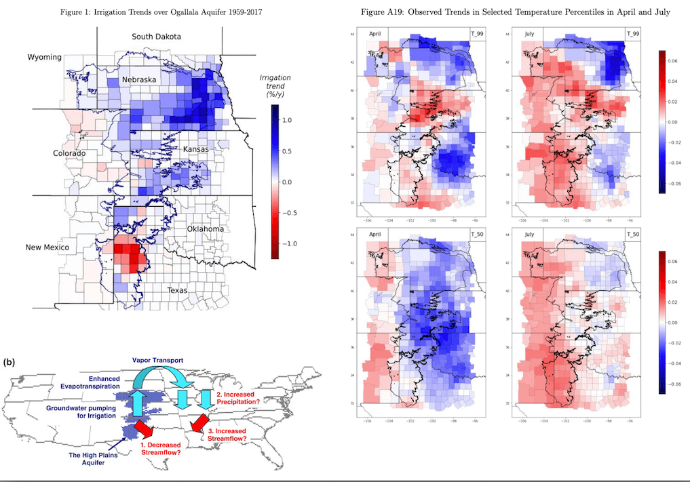

<!-- ---
class: middle

.content-box-green[**About me**]
+ My area of interest: Environmental Economics, Groundwater Management, the impact of climate change or weather shocks on agricultural production

```{r  echo = F, out.width = "80%"}

``` -->
<!-- <font size="2"> -->
<!-- Source: [Braun and Schlenker (2023)](https://www.nber.org/papers/w30966#:~:text=Cooling%2Dby%2Dirrigation%20propagates%20downwind,that%20are%20of%20equal%20magnitude); [Kustu et al.(2010)](https://www.sciencedirect.com/science/article/abs/pii/S0022169410004130) -->
<!-- </font> -->