class: middle

```{r, child = '../setup.rmd', cache = FALSE}
```


```{r, include = F, cache = FALSE}
# here::i_am("GitControlled/Recitation/1_Introduction/recitation1_slides.rmd")
```

```{r, eval=F, include=F}
httpgd::hgd()
httpgd::hgd_browse()
```


# Outline

1. [Introduction](#intro)
2. [Assignment Procedures](#assignment)
3. [R markdown to make a PDF file](#Rmarkdown)
4. [Gradescope submission](#gradescope)

---

class: inverse, center, middle
name: intro

# Introduction

<html><div style='float:left'></div><hr color='#EB811B' size=1px width=796px></html>

---
# Welcome to APEC8211-8212!!
.left4[
.content-box-green[**About me**]

+ My name is Shunkei Kakimoto
  * 2nd year Ph.D at APEC
+ I am from Japan

+ I like eating good food
  + Ramen restaurant: [Ichiddo ramen](https://www.roseville.ichiddo.com/)
  + Japanese food restaurant: [Sanjusan](https://www.sanjusanrestaurant.com/)
  + Ice cream store: [Sonny's Ice Cream](https://sonnysicecream.com)
]
.right6[

```{r  echo = F, out.width = "80%"}
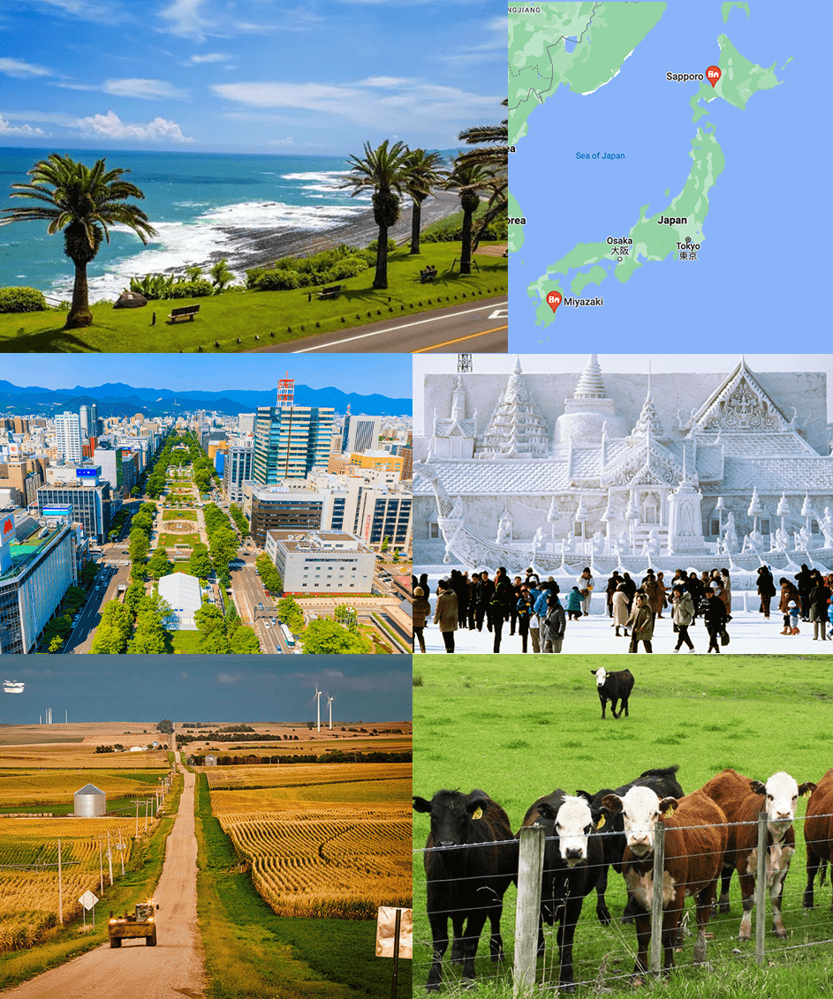
```
.pull-right[Source: Google Maps]
]


---
class: inverse, center, middle
name: assignment

# Assignment Prodecures
<html><div style='float:left'></div><hr color='#EB811B' size=1px width=796px></html>

---

<span style="color:red">Please read the document "Assignments in APEC 8211 and 8212".</span>

.content-box-green[**Assignment Submission**]
+ Submit your assignment as <span style="color:blue">one single PDF file including R codes and R outputs</span>
+ To create a PDF document: 
  * LaTeX, R markdown (I will demonstrate how to do it later)
+ Submission location: Gradescope

---

<span style="color:red">Please read the document "Assignments in APEC 8211 and 8212".</span>

.content-box-green[**Assignment Submission**]
+ Submit your assignment as <span style="color:blue">one single PDF file including R codes and R outputs</span>
+ To create a PDF document: 
  * LaTeX, R markdown (I will demonstrate how to do it later)
+ Submission location: Gradescope

.content-box-green[**Folder Organization**]
+ Every file needed for a given assignment—data, R codes, etc.—should be in the same directory (folder).

+ Example:

```{r, out.width = "80%"}
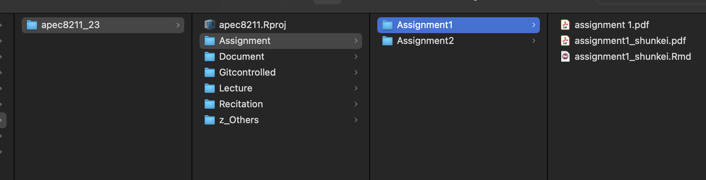
```

---
class: inverse, center, middle
name: Rmarkdown

# R markdown to make a PDF file
<html><div style='float:left'></div><hr color='#EB811B' size=1px width=796px></html>

---
class: middle
# Create PDF reports using R markdown
Of course LaTeX might be a first choice to make PDF report, but you can build a PDF report with [R markdown](https://rmarkdown.rstudio.com/lesson-1.html).

<br>

.content-box-green[**Pros**]

+ You can use LaTeX math notations to write math equations 
+ You can easily incorporate R codes and R outputs in the same document

---
## How to do it?
From top-down of New file icon, crick R Markdown -> Select PDF format -> A new Rmarkdown (`.Rmd`) file pops up -> Crick "Knit" bottom to run the Rmd file

.panelset[ 

.panel[.panel-name[1.New .Rmd file]
```{r, out.width = "60%"}
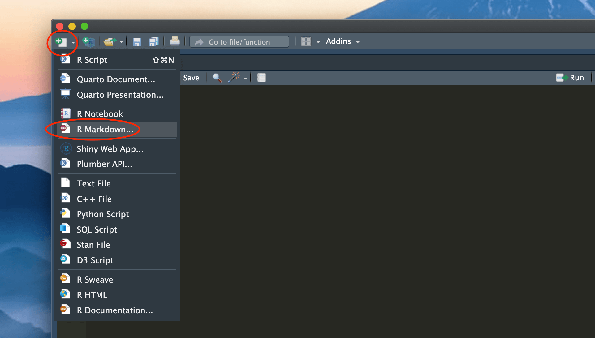
```
  ]

.panel[.panel-name[2.Select PDF format]
```{r, out.width = "60%"}
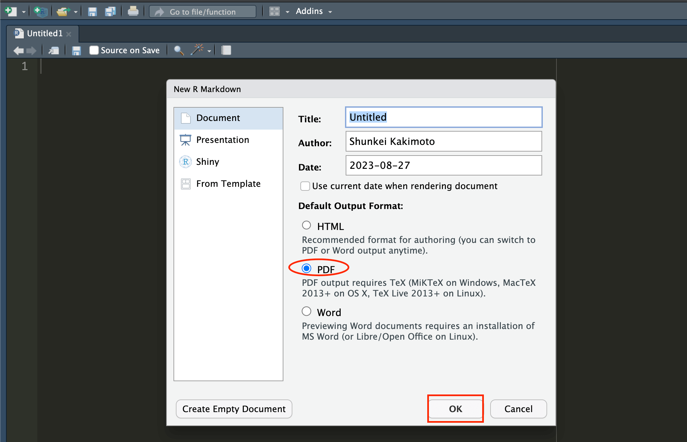
```
  ]

.panel[.panel-name[3.Crick Knit]
```{r, out.width = "60%"}
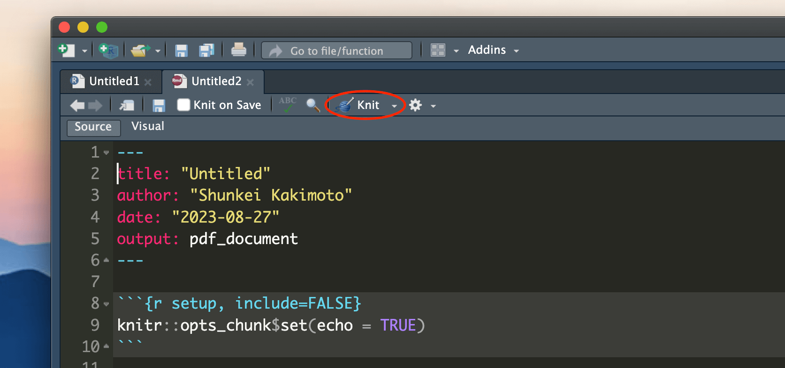
```
  ]

.panel[.panel-name[4.Output]
```{r, out.width = "40%"}
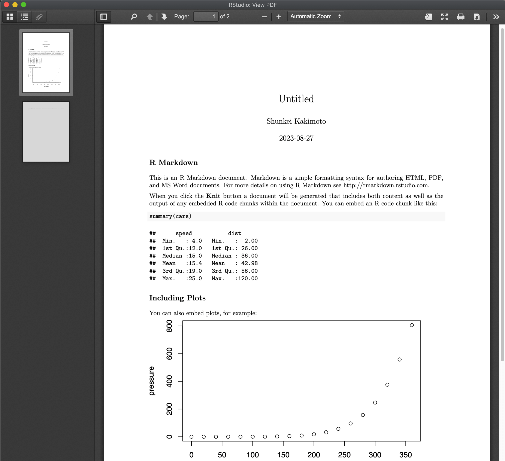
```
  ]
]

+ When you knit your `.Rmd` file, you may get an error message. If you are asked to install `tinytex` package, follow that instruction (e.g. Run `install.packages("tinytex")`)

---
class: middle

## For further information about R markdown

+ See the document "Using-R-Markdown.pdf" uploded on Canvas 

+ Also, see [R mark down Cheat Sheet](https://www.rstudio.com/wp-content/uploads/2015/02/rmarkdown-cheatsheet.pdf) 


---
class: middle
# Writing math equations with LaTeX Math Notations
See the document "Demonstration.pdf" on Canvas.
+ Section 1: Building blocks
+ Section 2: Example math equations

<br>

.content-box-green[**Exercise**]
+ Let's write some math equations using LaTeX math notations on your `.Rmd` (or `.rmd`) file and see it's correctly appeared on the output PDF document. 
+ Let's write some R codes and see how it looks like on the output file. 

---
# Example R codes

.panelset[ 

.panel[.panel-name[`R Base`]
.small[
```{r, echo=T}
# === Load data === #
# New York Air Quality Measurements
# This data is R Built-in Data Sets
data(airquality)
# to see the description about the data run, ?airquality
```

```{r, echo=T}
# --- Subset data from June --- #
may_dt <- airquality[airquality$Month==6,]
# Let's see the first five rows
head(may_dt)
```

```{r, echo=T}
# --- mean temperature by month ---
mean_temp <- aggregate(airquality$Temp, by=list(month=airquality$Month), FUN=mean)

mean_temp
```
]
  ]

.panel[.panel-name[`data.table`]
+ Introduction of `data.table` is [here](https://cran.r-project.org/web/packages/data.table/vignettes/datatable-intro.html)

.small[
```{r, echo=T}
# === Load package === #
# installed.packages("data.table") #If you have not installed
library(data.table)

# To use data.table functions, convert the data into data.table class
setDT(airquality)
```

```{r, echo=T}
# --- Subset data from June --- #
may_dt <- airquality[Month==6,]
head(may_dt, 5)
```

```{r, echo=T}
# --- mean temperature by month ---
mean_temp <- airquality[,.(mean_temp = mean(Temp)), by=Month]
mean_temp
```
]

  ]
]


---
# About R coding

+ If you are interested in learning more about R programming, I recommend that you take APEC 8221 (001) Programming for Econometrics (taught by Ali and Joe, 7 week course, 2 credits). 
  * You can still register!

---

# Useful shortcut keys in the RStudio

See [this](https://support.posit.co/hc/en-us/articles/200711853-Keyboard-Shortcuts-in-the-RStudio-IDE). 

Below, I list some shortcut keys that are commonly used. 


<!-- + insert chun -->

Description                        | Windows        | Mac
------------------------------------------| ------------------ | -------------
Insert chunk (Sweave and Knitr)    | Ctrl+Alt+I     | Cmd+Option+I
Knit Document (knitr) |Ctrl+Shift+K  |Cmd+Shift+K
Run current line/selection  |Ctrl+Enter  |Cmd+Return
Comment/uncomment current line/selection  | Ctrl+Shift+C | Cmd+Shift+C
Open document | Ctrl+O | Cmd+O

---
name: gradescope
# Gradescope submission
Assignment is submitted on Gradescope. The below is the procedures. 

.panelset[ 

.panel[.panel-name[1.Click assignment name]
```{r, out.width = "60%"}
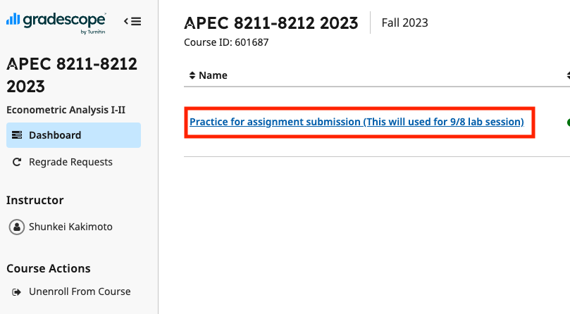
```
  ]

.panel[.panel-name[2.Click "Submit PDF"]
```{r, out.width = "50%"}
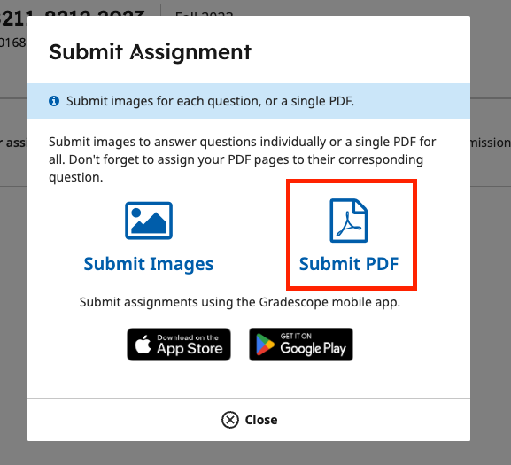
```
  ]

.panel[.panel-name[3.Select PDF and submit]
```{r, out.width = "50%"}
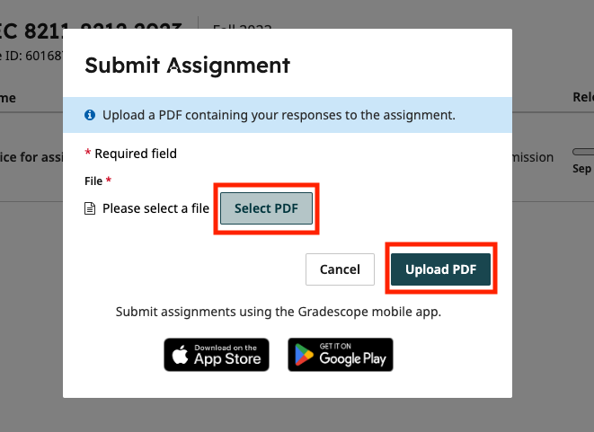
```
  ]

.panel[.panel-name[4.Note question locations]
Select questions and pages to indicate where your responses are located. 
```{r, out.width = "45%"}
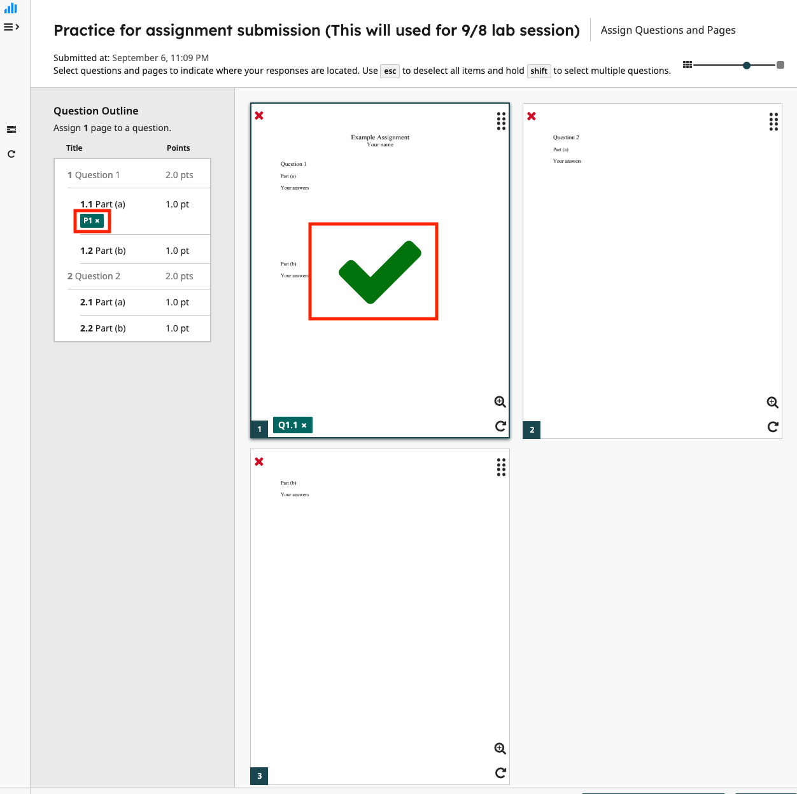
```
  ]

.panel[.panel-name[5.Submit assignment]
After noting all answer locations, submit your assignment.
```{r, out.width = "45%"}
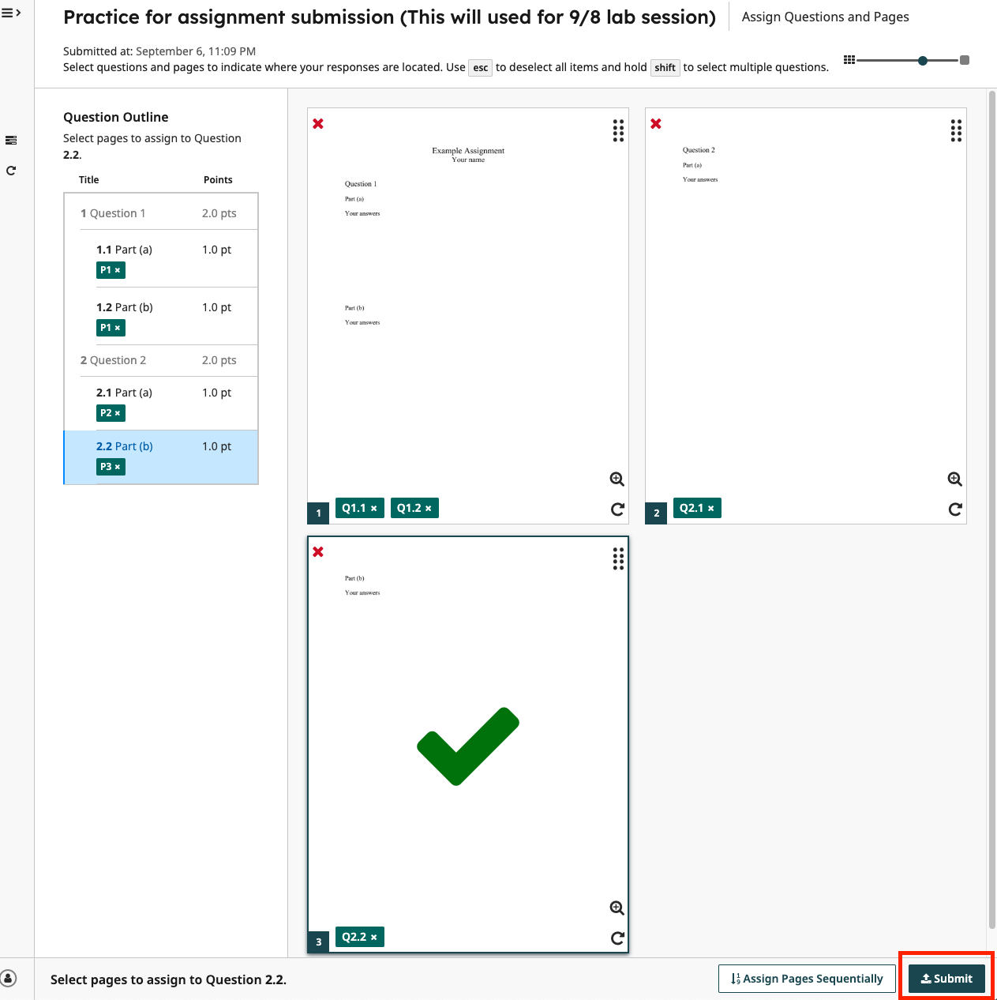
```
  ]
]


