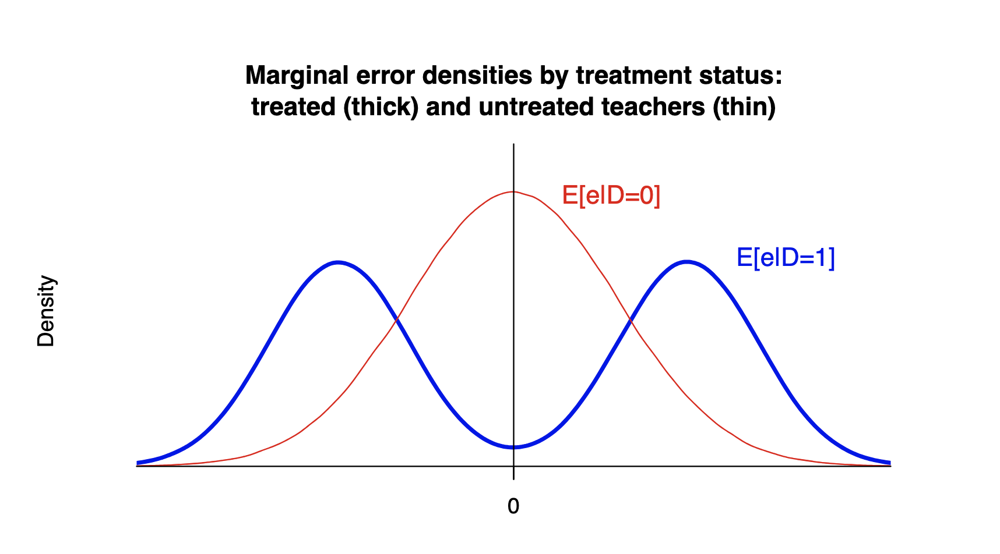

class: middle

```{r, child = '../setup.rmd', cache = FALSE}
```

```{r, include = F, cache = FALSE}
# here::i_am("GitControlled/Recitation/1_Introduction/recitation1_slides.rmd")
```


```{r, include = F, cache = FALSE}
library(data.table)
library(ggplot2)
library(dplyr)
library(gganimate)
library(gifski)
library(gganimate)
```

```{r, include = F, eval=F, cache = FALSE}
httpgd::hgd()
httpgd::hgd_browse()
```

```{r setup, include=FALSE, cache = FALSE}
options(htmltools.dir.version = FALSE)

# /*===== Reference =====*/
suppressMessages(library(RefManageR))

BibOptions(
  check.entries = FALSE,
  bib.style = "authoryear",
  style = "markdown",
  hyperlink = FALSE,
  dashed = TRUE,
  max.names = 2,
  longnamesfirst = FALSE
)
bib <- ReadBib("cite.bib")
```


.content-box-green[**A Useful tip:**]

hitting letter "o" key will give you a panel view of the slides

---
class: middle

# Outline
1. Quize (15 mins)
2. Independence, Mean independence, and Uncorrelatedness (orthogonality)
+ Small exercise problems [[here](#exercise)]

???
+ This is the outline for today. 
+ First thing first, let's do Quize. You have 15 minitues from now. 

---

class: inverse, center, middle
name: intro

# Independence, Mean independence, and Uncorrelatedness (orthogonality)

<html><div style='float:left'></div><hr color='#EB811B' size=1px width=796px></html>

???
+ Okay, we have 30 minutes left. I would like to talk about Independence, Mean independence, and Uncorrelatedness (orthogonality).

+ You know, as Joe told in the class, econometrics cares the error term, right?
+ These concepts are used as a statement of the relationship between the error term and the regressor. 

+ But dependending on which condition holds, the interpretation of the coefficient estimates vary. 

+ For example, if CIA hold, then the regression coefficient estimates has a causal interpretation.

+ and, as you will see in the later in this course, unbiasedness of OLS estimator relys on mean independence assumption, and consistency relies on orthogonality. 

---
class: middle

.content-box-green[**Example**]A simple linear CEF model

$$
Y = \beta_0 + \beta_1 X + e
$$


.content-box-green[**Question:**]
+ **What is the differences among $X \perp \!\!\! \perp e$, $E[e|X]=0$, and $E[Xe]=0$?**
+ **What is the logical implication among them?**

\begin{equation*}
X \perp \!\!\! \perp e \; \mathrel{\mathop{\rightleftarrows}^{\mathrm{?}}_{\mathrm{?}}} \; E[e|X]=0 \; \mathrel{\mathop{\rightleftarrows}^{\mathrm{?}}_{\mathrm{?}}} \; E[Xe]=0
\end{equation*}


???
+ Here, we specifically focus on the question about the distinction among independence, mean independence, and uncorrelatedness, and their logical implication.  

+ Here, Arrow means mathematical logic symbol. For example, if proposition A implies proposition B, then we can write $A \rightarrow B$.

+ Are we clear what we gonna do?

---
class: middle

# Before starting

Example: A simple linear projection model

\begin{align*}
Y = \beta_0 + \beta_1 X + e
\end{align*}

.content-box-red[**A property of linear projection error**]

+ <span style="color:blue"> $E[e]=0$ as long as an intercept is included in the model.</span>

???
+ Before we start, I want to confime one thing with you. 
+ That is, the expectation of the regression error is always $0$ as long as an intercept is included in the model. 
+ This is not an assumption at all but this is a sort a natural result of linear projection error. 

+ <span style="color:blue">This property is explained in the Hansen's book, but he does not explain why. </span>

---
class: middle

.content-box-green[**Demonstration**]
\begin{align*}
Y =  \beta_0 + \beta_1 X + u \quad \text{where } E[u]=\alpha \neq 0
\end{align*}

<br>

Rewriting the model, 
\begin{align*}
Y 
  &= \beta_0 + \beta_1 X + \alpha + (u-\alpha) \\
  &= \color{blue}{\beta_0 + \alpha} + \beta_1 X + \color{red}{u-\alpha} \\
  &= \color{blue}{\gamma_0} + \beta_1 X + \color{red}{e} \\
\end{align*}

where, $\color{blue}{\gamma_0=\beta_0 + \alpha}$ and $\color{red}{e=u-\alpha}$.

Now, $E[e]=E[u-\alpha]=E[u]-\alpha=\alpha-\alpha=0$.

???
+ Here is an explanation. Suppose that the expectation of error term $u$ is not equal to zero. 

+ Then, rewriting the model, the original error term $u$ can be decomposed into its expected value $\alpha$ and the other part, which is $u-\alpha$. 
+ $alpha$ is a constant, so we move $\alpha$ to the front, and in the final line, I define new intercept $\gamma_0$ and new error term $u-a$. 

+ Now, calculating the expectation of $u$, it's zero!
+ This is why, expectation of the error is always zero. 

---
# Independence, Mean independence, and Uncorrelatedness (orthogonality)


.content-box-red[**e and X are statistically independent**]: 

$X \perp \!\!\! \perp e \iff f(X, e) = f(X)f(e)$

**Verbally**: $e$ can tell nothing about $X$, and vice versa

<br>

.content-box-red[**e is mean independent of X**]: 

$E[e|X]=E[e]=0$

**Verbally**: Mean of $e$ does not depend on $X$.

<br>

.content-box-red[**e is uncorrelated with X (e and X are orthogonal)**]: 

$X \perp e \iff E[Xe]=0$

**Verbally**: No linear dependency between $e$ and $X$.


???
+ Okay, here is the short summary of independence, mean independence and uncorrelatedness about the explnatory variable $X$ and the error $e$. 

+ As you already know, Independence means statistical independence, right? 
+ If $e$ and $X$ are independent, the information about $e$ does not tell anything about the information of the distribution of $X$. 
+ <span style="color:blue">In other words, all the moments of the distribution of $e$ such as mean and variance and so on does not change by $X$, and vice versa.</span>

+ Meanwhile, if $e$ is mean independent of $X$, it means the mean of the distribution of $e$ does not depend on the value of $X$. 
+ It could be that higher moments such as variance changes with $e$. 

+ and, the uncorrelatedness or orthogonality of $e$ and $X$, <span style="color:blue">simply means there is no linear dependency between $e$ and $X$.</span>

+ We can see that independence is the strongest condition among these three because it says that all the moments of the distribution of $e$ are irrelevant to $X$. 

+ , and the uncorrelatedness is the weakest condition because it simply indicates a broad condition that $X$ and $e$ are not lineary dependent.

+ <span style="color:blue">Do you guys feel comfortable with why uncorrelatedness between $X$ and $e$ can be descrived like this?</span>

---
name: exercises
class: middle

If $X \perp e$, then $Cov(X, e)=0$. 

\begin{align*}
&\quad Cov(X, e)=0 \\
\iff&\quad E[Xe] - E[X]E[e]=0 \\
\iff&\quad E[Xe] =0 \quad (\text{because } E[e]=0)\\
\end{align*}


---
class: middle

\begin{equation*}
X \perp \!\!\! \perp e \; \mathrel{\mathop{\rightleftarrows}^{\mathrm{\circ}}_{\mathrm{\times}}} \; E[e|X]=0 \; \mathrel{\mathop{\rightleftarrows}^{\mathrm{\circ}}_{\mathrm{\times}}} \; E[Xe]=0
\end{equation*}


.content-box-green[**Exercise**]
+ Prove that if $X \perp \!\!\! \perp e$, then $E[e|X]=0$
+ Prove that if $E[e|X]=0$, then $E[Xe]=0$


???
+ Generally, this logical implication holds among independence, and mean independence and uncorrelatedness. 
+ That is, independence implies mean independence, and mean independence implies uncorrelatedness.   
+ But, the reverse is not true. 

+ Here are the simple exercise problems. 

---
## Example: Mean independence does not imply statistical independence

Case: $E[e|X]= 0$ is true but $X \perp \!\!\! \perp e$ is false

```{r, echo=F, out.width = "80%"}

```

$e$: unobserved teachers' teaching skills

$D$: participation to a teacher training program

(This is from Lecture Note 3, P63)

???
+ This an example showing mean indpendence does not imply statistical independence.  
+ This figure is from the lecture note. 
+ $e$ is unobserved teaching skill and $D$ is a dummy variable and it indicates the participation to a teacher training program. 
+ <span style="color:blue">mean of $e$ is the same for treatment and control group, but the distribution of $e$ of the treatment group could take this kind of distribution if teachers who are more likely to attend the training program are such that teachers with low skill and teacher with high skill.</span>

---
## Example: uncorrelatedness does not imply Mean independence
Case: $E[Xe]=0$ is true but $E[e|X] = 0$ is false


---
class: middle

\begin{equation*}
X \perp \!\!\! \perp e \; \xrightarrow{\circ} \; E[e|X]=0 \; \xrightarrow{\circ} \; E[Xe]=0
\end{equation*}

By contraposition,

+ $E[Xe]\neq0 \xrightarrow{\circ} E[e|X]\neq 0$
+ $E[e|X]\neq 0 \xrightarrow{\circ}$ $X$ and $e$ are dependent


Therefore, 

$E[Xe]\neq0 \xrightarrow{\circ}$ $X$ and $e$ are dependent

<br>

.content-box-red[**Implication**]: 

<span style="color:blue">To consider whether Selection-on-observables assumption holds, consider the possible correlation between $X$ and $e$.</span>

???
+ By contraposition, 

---

class: middle

# Don't get confused!

Some authors use (conditional) uncorrelatedness condition between the focal variable and the error term to explain the selection-observables assumption (CIA) in the context of regression model. 


<span style="color:blue">`r Citet(bib, "angrist1999empirical")`</span> P1290:

>"... The key identifying assumption is that the observable characteristics, $X_i$, are the only reason why $\eta_i$ and $S_i$ (equivalently $f_i(S)$ and $S_i$) are correlated, so 
>
$E[S_i \eta_i] =0$
.
>
>This is the "Selection on observables" assumption discussed by Barnow et al. (1981), where the regressor of interest is assumed to be determined independently of potential outcomes after accounting for a set of observable characteristics.

Here, $S_i$ is years of schooling and $\eta_i$ is the error. 

A similar explanation can be seen in <span style="color:blue">`r Citet(bib, "angrist2009mostly")`</span> P44.

???
+ Angrist and Krueger (1999): Empirical strategies in Labour Economics
+ Angrist and Piscke (2009): Mostly harmless econometrics

+ By the way, these books are great. I recommend that you read these books if you have not read. I know there is no time for you guys for this and next semester, but maybe next summer break. 

---
But,

+ <span style="color:blue">`r Citet(bib, "wooldridge2010econometric")`</span> P908: 
>"For many purpose, it suffices to assume ignorability in a conditional mean independence sense"


+ In the panel data setting, <span style="color:blue">`r Citet(bib, "wooldridge2010econometric")`</span>: 
>For examining consistency of panel data estimators, the zero covariance assumption generally suffices. Further, assumption of the zero covariance assumption is often the easiest way to think about whether strict exogeneity is likely to hold in a particular application."

---
# Reference

```{r, results='asis', echo=FALSE}
PrintBibliography(bib)
```

---
class: one-page-font

## Assignment 2: Question 4-(c)
You can write simulation codes in a different way. 

.panelset[ 

.panel[.panel-name[Data table way (assignment2code.r)]
.medium-code[
```{r, echo=T, cache=T}
set.seed(1234)

library(data.table)
n <- 1e7  # R notation for 1 x 10^7

mix <- 
  data.table(
    X = rchisq(n, 4), 
    Y = rchisq(n, 8), 
    Z = rchisq(n, 16),
    Q = sample(1:3, n, prob=c(0.25, 0.5, 0.25), replace=TRUE)
  )

# fcase gives M the value of X if Q==1, Y if Q==2, Z if Q==3
mix[ , M := fcase(Q==1, X, 
                  Q==2, Y,
                  Q==3, Z)]

# See the means of all columns (.SD means all columns).
# lapply()  translates to "Apply the function 'mean' to every column."
mix[ , lapply(.SD, mean)]
```
    ]
  ]


.panel[.panel-name[basic R functions]
.medium-code[
```{r, echo=T, cache=T}
set.seed(1234)

n <- 1e7  # R notation for 1 x 10^7

mix <- data.frame(
  X = rchisq(n, 4), 
  Y = rchisq(n, 8), 
  Z = rchisq(n, 16),
  Q = sample(1:3, n, prob=c(0.25, 0.5, 0.25), replace=TRUE)
  )

# sntax: ifelse(condition, x if condition is met, y otherwise)
mix$M <- 
  ifelse(mix$Q==1, mix$X,
    ifelse(mix$Q==2, mix$Y, mix$Z))

colMeans(mix)
```
    ]
  ]


.panel[.panel-name[dplyr way]
Don't use dplyr in the test!
.medium-code[
```{r, echo=T, cache=T}
set.seed(1234)

library(dplyr)

n <- 1e7  # R notation for 1 x 10^7

mix <- data.frame(
  X = rchisq(n, 4), 
  Y = rchisq(n, 8), 
  Z = rchisq(n, 16),
  Q = sample(1:3, n, prob=c(0.25, 0.5, 0.25), replace=TRUE))

# case_when is the dplyr version of fcase 
mix <- mutate(mix, M = case_when(Q==1 ~ X, Q==2 ~ Y, Q==3 ~ Z))

# 
summarise(mix,  across(X:M, mean))
# this is equivalent to 
# summarise(mix, X=mean(X), Y=mean(Y), Z=mean(Z), Q=mean(Q), M=mean(M))
```
    ]
  ]
]


