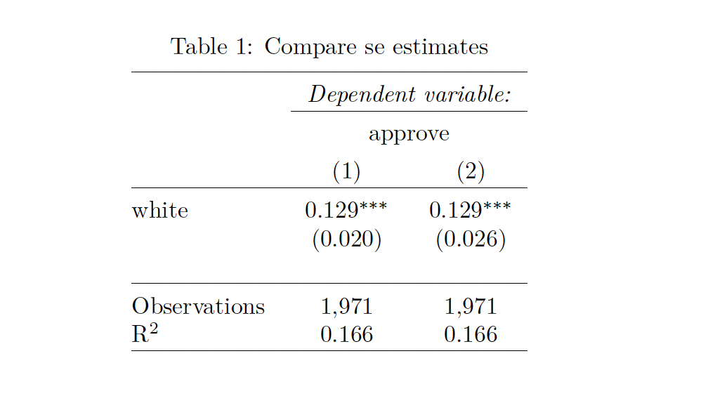

class: middle

```{r, child = '../setup.rmd', cache = FALSE}
```

```{r xaringan-scribble, echo=FALSE}
xaringanExtra::use_scribble()
```


```{r setup, include=FALSE, cache = FALSE}
options(htmltools.dir.version = FALSE)

# /*===== Reference =====*/
suppressMessages(library(RefManageR))

BibOptions(
  check.entries = FALSE,
  bib.style = "authoryear",
  style = "markdown",
  hyperlink = FALSE,
  dashed = TRUE,
  max.names = 2,
  longnamesfirst = FALSE
)
bib <- ReadBib("cite.bib")
```

```{r, include = F, cache = FALSE}
library(data.table)
library(ggplot2)
library(dplyr)
library(gganimate)
library(gifski)
library(gganimate)
# library(learnr)
```

```{r, include = F, eval=F, cache = FALSE}
httpgd::hgd()
httpgd::hgd_browse()
```

```{r xaringan-tachyons, echo=FALSE}
xaringanExtra::use_tachyons()
```


.content-box-green[**A Useful tip:**]

hitting letter "o" key will give you a panel view of the slides

---
class: middle

# Outline
1. [Brief review of heteroskedasticity](#hete).
2. [How to obtain het-robust variance covariance estimates in R?](#hete_r)
3. [Exercise problem 1](#Exercise1) 
4. [Exercise problem 2](#Exercise2) 

+ okay, today, I wannna talk about the problem of heteroskedasticity and how to estimate heteroskedasticity-robust standard errors with R. 

---
class: inverse, center, middle
name: hete

# Brief review of the theories of heteroskedasticity.

<html><div style='float:left'></div><hr color='#EB811B' size=1px width=796px></html>

???
+ First, let's do a quick review of heteroskedasticity. 

---
class: middle

.content-box-green[**Question:**]

Why do we care about heteroskedasticity? What is the consequence of disregarding this problem?

???
+ Here is the question for you guys.
+ Why do we car about heteroskeasticity?

+ (1) In the presence of heteroskedasticity, the OLS estimator is inefficient, that is OLS estimator returns imprecise coefficient estimates. 
  * According to the Gauss-Markov theorem, OLS is the best liear unbiased estimator under the homoskedasticity. But, in the case of  heteroskedasticity, the OLS is not the most efficient anymore, but instead, GLS is the most efficient estimator. 
  

+ (2) and estimates of the OLS standard error becomes biased, and therefore the subsequent  statistical inference based on those biased standard error estimates is incorrect. 

+ **the next question is that** do you think that the heterosekdasticity affects the unbiasedness or consistency property of OLS?

+ Right, so the point here is that, heteroskedasticity matters for statistical inference but it does not affect unbiasedness and consistency of OLS. 

+ Statistical inference is the main theme of this last half of this class.


---
class: middle

## By the way...

Heteroskedasticity is one type of the violation of the "classical" homoskedasticity assumption.  


.bg-washed-green.b--dark-green.ba.bw2.br3.shadow-2.ph2.mt2[
<b>Homoskedastic errors (or Spherical errors)</b>: 

$$Var[\mathbf{e}|\mathbf{X}]=\sigma^2 \mathbf{I} =
\begin{bmatrix}
\sigma^2 & 0 & \cdots & 0 \\
0 & \sigma^2 & \cdots & 0 \\
\vdots & \vdots & \ddots & \vdots \\
0 & 0 & \cdots & \sigma^2
\end{bmatrix}$$

+ **Verbally:** the errors have uniform variance (all the diagonal elements of the vcov matrix are the same) and are not correlated with one another (all the off-diagonal elements of the vcov matrix are zero).
]

???
+ This is a digression.

+ As you might know, the non-homoskedastic errors do not always mean heteroskedasticity, right?
+ Heteroskedasticity is one type of the violation of the classical homoskedasticity. 

+ Homoskedasticity errors a specific type of errors such that have uniform variance, and not correlated  variance is defined as $Var[e|X]=Var[e]=\sigma^2$. That is, the variance of the error terms is independent of $X$ and consistent. 

+ 

---
class: middle

+ So, the violation of the "classical" homoskedasticity assumption means that the errors are either not uniform or correlated with each other, or both. 


+ 

---
class: middle

## Nonspherical Errors

.bg-washed-green.b--dark-green.ba.bw2.br3.shadow-2.ph2.mt2[
<b>Heteroskedastic errors</b>

**Verbally**: The off-diagonal elements of the vcov matrix of the errors are assumed to be zero, but the diagonal elements are not all equal, varying in size with an independent variable. 
$$Var[\mathbf{e}|\mathbf{X}]=
\begin{bmatrix}
\sigma^2_1 & 0 & \cdots & 0 \\
0 & \sigma^2_2 & \cdots & 0 \\
\vdots & \vdots & \ddots & \vdots \\
0 & 0 & \cdots & \sigma^2_n
\end{bmatrix}$$
]

.bg-washed-green.b--dark-green.ba.bw2.br3.shadow-2.ph2.mt2[
<b>Autocorrelated errors</b>

**Verbally**: The off-diagonal elements of the vcov matrix of the errors are non-zero.
  * Example: clustered errors (APEC8212), serial correlation in time series models (APEC8213)
]

???


---


class: middle

## Variance of Least squares Estimator

.content-box-red[**Important!**]

$$\mathbf{V}_{\hat{\beta}} = Var[\hat{\beta}|\mathbf{X}]=\mathbf{(X^{\prime}X)^{-1}X^{\prime}\mathbf{D}X(X^{\prime}X)^{-1}}$$

, where $\mathbf{D}=Var[\mathbf{e|X}]=E[\mathbf{ee^{\prime}|X}]$

<br>

.content-box-green[**NOTE:**]

1. This is called <b span style="color:blue">actual, or theoretical variance</b span>, not to be confused with $\hat{\mathbf{V}}_{\hat{\beta}}$, which is the estimator for $\mathbf{V}_{\hat{\beta}}$. 


---
class: middle

## Variance of Least squares Estimator

.content-box-red[**Important!**]

$$\mathbf{V}_{\hat{\beta}} = Var[\hat{\beta}|\mathbf{X}]=\mathbf{(X^{\prime}X)^{-1}X^{\prime}\color{red}{\mathbf{D}}X(X^{\prime}X)^{-1}}$$

, where $\color{red}{\mathbf{D}}=Var[\mathbf{e|X}]=E[\mathbf{ee^{\prime}|X}]$

<br>

.content-box-green[**NOTE:**]

1. This is called <b span style="color:blue">actual, or theoretical variance</b span>, not to be confused with $\widehat{\mathbf{V}}_{\hat{\beta}}$, which is the estimator of $\mathbf{V}_{\hat{\beta}}$. 

2. We need to estimate $\color{red}{\mathbf{D}}=Var[\mathbf{e|X}]$. 

+ WLS (a special case of FGLS)
  * If you know something about the variance of the error terms
+ Run OLS and report heteroskedasticity-robust standard errors


---
class: inverse, center, middle
name: hete_r

# How to obtain het-robust variance covariance estimates in R?

<html><div style='float:left'></div><hr color='#EB811B' size=1px width=796px></html>
---
class: middle

+ There are various ways to obtain het-robust standard error estimates (e.g., `coeftest()` from `lmtest` package). 
+ In this class, we mainly use `vcovHC()` function from `sandwich` package. `vcovHC()` returns a <span style="color:blue">het-robust variance-covariance matrix</span> of the coefficient estimates in regression models.

<br>

.content-box-green[**Question**]

+ How to get the standard errors of the coefficient estimates from the estimated het-robust variance covariance matrix?


???
+ `vcovHC()` returns a het-robust variance-covariance matrix. Given the matrix, we get het-robust se. 

---
class; middle

## Process

1. Estimate the model using OLS (you do nothing special here)
2. Assuming the error term is heteorskedastic, estimate the het-robust standard errors for each coefficient estimates. 
3. Replace the estimates from $s(\beta)_{default}$ with $s(\beta)_{robust}$. 


---
class: middle

```{r, eval=F}
# If you haven't installed the package yet
install.packages("sandwich")
```

<br>

.content-box-green[**General Syntax**]

Here is the general syntax to obtain various types of VCOV (and se) estimates
```{r, eval=F}
# === Het-robust variance-covariance matrix ===
cov <- vcovHC(regression result, type="type of vcov")

# === Het-robust standard error estimates ===
# Extract the diagonal elements and compute square-roots of them
sqrt(diag(cov))
```

In `type=`, you specify a type of het-robust estimator (e.g., `type="HC3"`). 


---
class: middle
## Demonstration

.panelset[ 

.panel[.panel-name[Description]

+ From Exercise 7.8 from  *Introductory Econometrics* by Jeff Wooldridge (p260, 4th edition). 

+ We want to see whether the minority applicants (black and Hispanic applicants) are discriminatorily rejected for their mortgage loan applications relative to white applicants with a linear probability model. 

.content-box-green[**Model**]
$$approve = \beta_0 + \beta_1 white + \text{other characteristics}$$

.content-box-green[**Main variables**]

$approve :=$ $1$ if a mortgage loan to an individual was approved, otherwise $0$.

$white :=$ $1$ if the applicant was white, otherwise $0$.
  ]


.panel[.panel-name[Data loading]

* Studies can be found [here](https://link.springer.com/article/10.1007/bf00174551)
* The description about the data can be found [here](https://justinmshea.github.io/wooldridge/reference/loanapp.html)

```{r}
# === Load packages === #
library(sandwich) 
library(wooldridge)

# === Load "loanapp" data from "wooldridge" package === #
data(loanapp)
```
  ]
]

---
class: middle

## Run a regression model and get het-robust standard errors

```{r}
# === Run a regression === #
reg <- lm(approve ~ white + hrat + obrat + loanprc + unem + male + married + 
  dep + sch + cosign + chist + pubrec + mortlat1 + mortlat2 + vr, 
  data=loanapp)

# === Non-robust standard errors (default) === #
reg_se <- sqrt(diag(vcov(reg)))

# === het-robust standard errors === #
reg_se_hc3 <- sqrt(diag(vcovHC(reg, type="HC3")))
```

---
class: middle

## Create a regression table with stargazer( )

.panelset[ 

.panel[.panel-name[Code]

I will report only the coefficient estimate of `white`.

.medium-code[
```{r, eval=FALSE}
# === Report regression results === #
library(stargazer)

stargazer(
  # --- regression objects --- $
  reg, reg,
  # --- a list of standard errors --- #
  se=list(reg_se, reg_se_hc3),
  # --- keep only "white" variable--- #
  keep = "white",
  # --- what type of output --- #
  type="html", #change this part accordingly,
  # --- other small options (these are not necessary) --- #
  header = FALSE,
  column.labels=c('non-robust','het-robust'),
  title = "Compare se estimates",
  omit.stat=c("adj.rsq","ser","f"),
  table.layout="-ld#-t-s-"
  )
```
    ]

You need to specify `type=` depending on the format of your output document:
+ For pdf output, use `type=latex`.
+ For html output, use `type=html`.
+ If you want to see the result on R console, use `type=text`.
  ]

.panel[.panel-name[Output: type="text"]

If you use `type="text"`, you get something like this.

```{r, echo=F}
library(stargazer)

stargazer(
  # --- regression objects --- $
  reg, reg,
  # --- a list of standard errors --- #
  se=list(reg_se, reg_se_hc3),
  # --- keep only "white" variable--- #
  keep = "white",
  # --- what type of output --- #
  type="text", #change this part accordingly
  # --- other options (these are not necessary)--- #
  header = FALSE,
  column.labels=c("non-robust", "het-robust"),
  title = "Compare se estimates",
  omit.stat=c("adj.rsq","ser","f"),
  table.layout="-ld#-t-s-"
  )
```
  ]
.panel[.panel-name[Output: type="html"]

Use `type="html"`, if you desire html output.

This html output is so bad because of my Rmakrdown settings. haha 

```{r, echo=F, results="asis"}
library(stargazer)

stargazer(
  # --- regression objects --- $
  reg, reg,
  # --- a list of standard errors --- #
  se=list(reg_se, reg_se_hc3),
  # --- keep only "white" variable--- #
  keep = "white",
  # --- what type of output --- #
  type="html", #change this part accordingly
  # --- other options --- #
  header = FALSE,
  column.labels=c("non-robust", "het-robust"),
  title = "Compare se estimates",
  omit.stat=c("adj.rsq","ser","f"),
  table.layout="-ld#-t-s-"
  )
```

  ]

.panel[.panel-name[Output: type="latex"]

Use `type="latex"`, if you desire Latex (pdf) output.

```{r, echo=F, out.width = "80%"}

```
  ]
]

---

class: middle

.content-box-red[**NOTE:**]

When you use `stargazer()` in your Rmarkdown file to generate an html or pdf output, make sure to include `results = "asis"` in the r chunk option. 

<br>

.content-box-green[**Example:**]

````markdown
* `r ''````{r, results = "asis"}
stargazer(
  reg,
  keep = "white",
  # --- what type of output --- #
  type="latex", # for pdf output
  # --- other options --- #
  header = FALSE,
  omit.stat=c("adj.rsq","ser","f"),
  table.layout="-ld#-t-s-"
  )
```
````

---
class: middle

For more details, take a look at this website: ["A Stargazer Cheatsheet"](https://www.jakeruss.com/cheatsheets/stargazer/)

---
class: middle

By the way, I don't mind if you report your regression result with `summary()` function or `coeftest()` function (from `lmtest` package) in your assignment. 

.medium-code[
```{r}
library(lmtest)

coeftest(reg)
```
]


???
+ Having said that, I personally don't mind whether you use stargazer or basic summary function in your assignment. So, it's up to you. 

---
name: Exercise1
class: middle

## Exercise 1, E 4.22

An economist friend tells you that the assumption that the observations $(Y_i, X_i)$ are i.i.d. implies that the regression $Y=X^{\prime} \beta +e$ is homoskedastic. Do you agree with your friend? How would you explain your position?

???
+ Transformations of i.i.d. variables are also i.i.d. 
---

## Exercise 2, E 3.24, 4.24

Use the `cps09mar` dataset (March 2009 Current Population Survey) on the canvas. 

(1) Subset for single (never married) Asian men with less than 45 years experience. The total number of observations should be $267$. 

+ See cps09mar_description.pdf to refer to which variables should be used.
+ $experience$ is `age-education-6`

(2) Estimate the regression model: $log(wage)=\beta_0 + \beta_1 education + \beta_2 experience + \beta_3 experience^2/100 + e$. 

+ $wage$ is  `earnings/(hours*week)`


(3) Report the regression results with standard errors using the homoskedasticity formula and using the four het-robust variance-covariance formulas (HC0, HC1, HC2, HC3).  

```{r, echo=F, eval=F}
library(data.table)
library(rio)
library(sandwich)
library(dplyr)

data <- 
  import("Data/hansen_data/cps09mar/cps09mar.dta") %>%
  data.table()

sub_data <-   
  data %>%
  .[marital==7 & race==4 & female==0,] %>%
  .[, exp := age - education - 6] %>%
  .[exp < 45,] %>%
  .[, wage := earnings/(hours*week)] %>%
  .[, exp2 := exp*exp/100]

reg <- lm(log(wage) ~ education + exp + exp2, data=sub_data)

se <- sqrt(diag(vcov(reg)))
se_hc0 <- sqrt(diag(vcovHC(reg, type="HC0")))
se_hc1 <- sqrt(diag(vcovHC(reg, type="HC1")))
se_hc2 <- sqrt(diag(vcovHC(reg, type="HC2")))
se_hc3 <- sqrt(diag(vcovHC(reg, type="HC3")))

stargazer(
  # --- regression objects --- $
  reg, reg, reg, reg, reg,
  # --- a list of standard errors --- #
  se=list(se, se_hc0, se_hc1, se_hc2, se_hc3),
  # --- what type of output --- #
  type="text", #change this part accordingly
  # --- other options (these are not necessary)--- #
  header = FALSE,
  column.labels=c("non-robust", "het-robust"),
  title = "Compare se estimates",
  omit.stat=c("adj.rsq","ser","f"),
  table.layout="-ld#-t-s-"
  )
```


