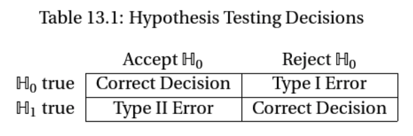

class: middle

```{r, child = '../setup.rmd', cache = FALSE}
```

```{r xaringan-scribble, echo=FALSE}
xaringanExtra::use_scribble()
```


```{r setup, include=FALSE, cache = FALSE}
options(htmltools.dir.version = FALSE)

# /*===== Reference =====*/
suppressMessages(library(RefManageR))

BibOptions(
  check.entries = FALSE,
  bib.style = "authoryear",
  style = "markdown",
  hyperlink = FALSE,
  dashed = TRUE,
  max.names = 2,
  longnamesfirst = FALSE
)
bib <- ReadBib("cite.bib")
```

```{r, include = F, cache = FALSE}
library(data.table)
library(ggplot2)
library(dplyr)
library(gganimate)
library(gifski)
library(gganimate)
# library(learnr)
```

```{r, include = F, eval=F, cache = FALSE}
httpgd::hgd()
httpgd::hgd_browse()
```

```{r xaringan-tachyons, echo=FALSE}
xaringanExtra::use_tachyons()
```


.content-box-green[**A Useful tip:**]

hitting letter "o" key will give you a panel view of the slides


---
class: middle

# Outline
1.t-test, Wald test 
  * t-statistic - distance between the two scalers
  * Wald statistic - distance between  the two vectors (the length of the vector $\hat{\theta}-\theta_0$: the discrepancy between the estimator $\hat{\theta}=r(\hat{\beta})$ and the hypothesized value $\theta_0$.)
  * connection? Think about the case where $\hat{\theta}$ and $\theta$ takes a scaler not a vector.
    - t-values are the square root of a W test

2.Application of the Wald Test
+ Exercise Problem 

3.Confidence interval calculation

3.Other test statistics

+ If the restrictions are nonlinear 
  * Wald tests of nonlinear hypothesis, though asymptotically valid, can be unreliable even in fairly large samples (E 9.18)
  * Instead, for nonlinear hypothesis, use the minimum distance statistic. 


---

# Hypothesis testing: Basics

From Lecture note 11, p7

```{r, echo=F, out.width = "40%"}

```

<br>

<b><span style="color:red">size of a hypothesis test = Pr(Type I error)</span></b>

**verbally**: The probability that we will falsely reject the null hypothesis

<b><span style="color:red">power of a test =1-Pr(Type II error)</span></b>

**verbally**: The probability that we will correctly reject the null hypothesis


We set the size of the test (called *significance level* $\alpha$) to 

<!-- .bg-washed-green.b--dark-green.ba.bw2.br3.shadow-2.ph2.mt2[
**<span style="color:red">Type I error</span>**

]
 -->
???

+ Type I: a false rejection of $H_0$ when $H_0$ is true
+ Type II: a false acceptance of $H_0$ when $H_1$ is true

+ We have two types of error 
+ To evaluate these two types of errors in terms of probability. 


---

# t-test

$$
T = \frac{\hat{\theta}-\theta_0}{\sqrt{Var(\hat{\theta})}}
$$

**Verbally**: t-statistic measures the distance between the estimates 

Remember, t-statistic is a random variable, meaning it has a sampling distribution.  


???
+ We learned t-test in undergrad level of statistic or econometrics. Under the assumption that regression error is normally distributed, t-statistics follows t-distribution. But that's not what we should do in graduate level econometrics. Usually, we don't say anything about the distribution of the error. Instead of using the finite sample property of t-statics which heavily rely on the unrealistic assumption, we use a asymptotic theory. 
+ That is, 


---
class: middle

.content-box-red[**t-test**]


$$T(\theta)=\frac{\hat{\theta}-\theta}{s(\hat{\theta})} \xrightarrow{d} $$

.content-box-green[**Question**]

Which asymptotic theory is used for this?

---

# The size and power of a hypothesis test


???
+ Have you had a chance to review
+ 
---

.content-box-red[**Question**]


---
class: middle 

.content-box-green[**Question**]

The nominal (intended) size of the test and the actual size of the test can be different. Why?


---
class: middle

# Exercise 1: 2022 Final Test Problem 1 (a)

If a standard error is biased toward zero, how does that affect the outcome of a *t*-test that uses a $5\%$ significance level (nominal size)? What about a $95 \%$ confidence interval based on it?

By "how does that affect the outcome" I mean: Does the test reject the right function of the time, too often, or not often enough? Are confidence intervals too long, too short, or just right?


---
class: middle

# Exercise 2: 2022 Final Test Problem 2 (b)

Hansen and Mackinnon, Nielsen, and Webb note that the HC3 and CV3 variance estimators are “conservative.” What does that mean for a t-test that uses a 5% significance level?


---
class: middle

# Exercise 3: 2022 Final Test Problem 1 (c)

Another problem is using the wrong approximation for the sampling distribution
of a $t$-statistic. Suppose the situation is a shown in the diagram below. The researcher doesn't know the actual sampling distribution of her $t$-statistics (red), so she assumes they are well approximated by the standard normal distribution. How does that affect the outcome of a $t$-test that uses a $5 \%$ significance level?


---
class: middle

.content-box-green[**The Wald test**]


---


# Exercise 3: 2022 Final Test Problem 4 (modified)

We studied Wald tests about multiple regression coefficients, for example $H_0: \beta_1=\beta_2=\beta_3=0$.

(a) After running the regression, what are the steps involved in calculating the Wald statistic? (You can write down a version of the Wald statistic and describe how you ge the various parts.)


(b) Now that you have your Wald statistic, what should you do with it to determine whether to reject the null hypothesis? (Assume a regression where clustering is not an issue.)


---
class: middle

The Delta Method is also used to derive the asymptotic distribution of some test statistics. 

.content-box-green[**Question:**] 

What is the asymptotic distribution of t-statistic and the Wald statistic?


$$W(\theta)=(\hat{\theta}-\theta)^{\prime}\hat{\mathbf{V}}^{-1}_{\hat{\theta}}(\hat{\theta}-\theta) \xrightarrow{d} ?$$


???

+ We learned that for hypothetical testing, we need a sampling distribution of test statistics. But we never know the sampling distribution of the test statistic, so we need a asymptotic distribution of the test statistics
  * another approach that does not depend on the asymptotic distribution is bootstrapping. 

---
class: middle

The Delta Method is also used to derive the asymptotic distribution of some test statistics. 

<br>

.content-box-green[**Question:**] 

What is the asymptotic distribution of t-statistic and the Wald statistic?

See E 7.12
$$T(\theta)=\frac{\hat{\theta}-\theta}{s(\hat{\theta})} \xrightarrow{d} N(0,1)$$

See E 7.16
$$W(\theta)=(\hat{\theta}-\theta)^{\prime}\hat{\mathbf{V}}^{-1}_{\hat{\theta}}(\hat{\theta}-\theta) \xrightarrow{d} \chi^2_{k}$$

???
+ About t-stat, because $s(\hat{V}_\theta)=\sqrt{\hat{V}_\theta}$, $V_\theta= n V_{\theta}$, and $\sqrt{n}(\hat{\theta}-\theta) \xrightarrow{d} N(0, \V_{\theta})$
