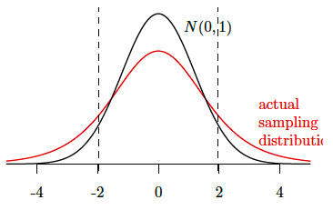

class: middle

```{r, child = '../setup.rmd', cache = FALSE}
```

```{r xaringan-scribble, echo=FALSE}
xaringanExtra::use_scribble()
```


```{r setup, include=FALSE, cache = FALSE}
options(htmltools.dir.version = FALSE)

# /*===== Reference =====*/
suppressMessages(library(RefManageR))

BibOptions(
  check.entries = FALSE,
  bib.style = "authoryear",
  style = "markdown",
  hyperlink = FALSE,
  dashed = TRUE,
  max.names = 2,
  longnamesfirst = FALSE
)
bib <- ReadBib("cite.bib")
```

```{r, include = F, cache = FALSE}
library(data.table)
library(ggplot2)
library(dplyr)
library(gganimate)
library(gifski)
library(gganimate)
# library(learnr)
```

```{r, include = F, eval=F, cache = FALSE}
httpgd::hgd()
httpgd::hgd_browse()
```

```{r xaringan-tachyons, echo=FALSE}
xaringanExtra::use_tachyons()
```


.content-box-green[**A Useful tip:**]

hitting letter "o" key will give you a panel view of the slides


---
class: middle

# Outline
1.[Review t-tests](#t)

+ [Short Exercise problem 1](#Ex1) 
+ [Short Exercise problem 2](#Ex2) 
+ [Short Exercise problem 3](#Ex3) 

2.[Review Wald tests](#wald)

+ [Exercise Problem 3](#Ex4)

<!-- 
3.Other test statistics

+ If the restrictions are nonlinear 
  * Wald tests of nonlinear hypothesis, though asymptotically valid, can be unreliable even in fairly large samples (E 9.18)
  * Instead, for nonlinear hypothesis, use the minimum distance statistic. 
 -->

???
+ For statistical inference, we mainly covered two approaches in the class, which are t-tests and wald-tests. 

+ The t-test is used for one dimensional hypothesis like $\beta_1=0$
  * the t-test is appropriate when the null hypothesis is a real-valued restriction

+ Meanwhile, the wald-test is used for multi-dimentional hypothesis such as the coefficients of education and age are zero. 

+ But the process is are similar. 
+ For example, t-test use a t-statistic to measures a distance between the two scalars and the Wald test uses a wald statistic to distance between the two vectors, and we judge whether the observed difference is extreme or not relative to their asymptotic distribution.

---
class: inverse, center, middle
name: intro

# t-tests

<html><div style='float:left'></div><hr color='#EB811B' size=1px width=796px></html>

???

+ okay, let's start with t-test. 

---
class: middle

Suppose 
$$\begin{align*}
H_0:&\, \theta= \theta_0 \\
H_1:&\, \theta \neq \theta_0
\end{align*}$$


.bg-washed-green.b--dark-green.ba.bw2.br3.shadow-2.ph2.mt2[
<b>t-statistic</b>
$$
T = \frac{\hat{\theta}-\theta_0}{s(\hat{\theta})}
$$
**Verbally**: a t-statistic measures how much an estimate $(\hat{\theta})$ of the parameter far away from the parameter value under the null hypothesis $(\theta_0)$ (measured by units of the estimated standard error).
]

.content-box-green[**NOTE:**]
+ $\theta$ is a scalar $(H_0:\, \theta= \theta_0 \in \mathbb{R})$. 
  * it could be $\beta_j$ or any single linear constraint (e.g., $H_0:\beta_1+\beta_2=0$)


???
+ The concept of t-test is straightforward. 
+ We use a measurement called t-statistic. t-statistic measures how much the estimate we get far away from the parameter value under the null hypothesis. 
+ Then, under the null hypothesis (that is if the null hypothesis is true), we should expect that our estimate should be not so much different from the hypothesized value. So, we should expect that t-value should be small. 
+ But if t-value is larger than a critical value, then we regard it as an evidence showing the null hypothesis is not likely true, so we reject the null hypothesis. 

---
class: middle

A t-statistic is a random variable. Therefore it has a sampling distribution. But we don't know the actual sampling distribution of *t*-statistics (unless we rely on an unrealistic assumption such as the regression error is normally distributed). 

So, we rely on the asymptotic property of t-statistics. 

<!-- + If we assume normality of the regression error (nor realistic), t-statistic has follows a t-distribution (n-k-1 degree of freedom) as a finite sample property -->
???
+ To determine whether t-value is larger than some criteria or not, we need a distribution of a t-statistics. 
+ t-statistic is a random variable, so it has a sampling distribution. but as usual, we don't know the actual sampling distribution. 
+ So, we rely of the asymptotic distribution of a t-statistics. 


---
class: middle
.bg-washed-green.b--dark-green.ba.bw2.br3.shadow-2.ph2.mt2[
<b>Asymptotic distribution of t-statistic</b>

$$T=\frac{\hat{\theta}-\theta_0}{s(\hat{\theta})} \xrightarrow{d} N(0,1) \quad \text{ as } n\rightarrow \infty$$
]

A t-statistic is an <span style="color:blue">asymptotically pivotal statistic</span> 

<!-- (that is, Asymptotic distribution of a t-static does not depend on parameter being estimated!)  -->

&rarr; The bootstrap distribution gives better approximation of the sampling distribution of t-statistics than the asymptotic distribution (<span style="color:blue">asymptotic refinement</span>). 

???
+ As you know, the asymptotic distribution of a t-statistic is standard normal. 
+ Maybe, an important thing that you might want to remember here is that t-statistic is a asymptotically pivotal statistic, that is, the asymptotic distribution of the t-statistic does not depend on any parameter we need to estimate. 

+ we can obtain take advantage of asymptotic refinements of bootstrapping. 

---
class: middle
.bg-washed-green.b--dark-green.ba.bw2.br3.shadow-2.ph2.mt2[
<b>Asymptotic distribution of t-statistic</b>

$$T=\frac{\hat{\theta}-\theta_0}{s(\hat{\theta})} \xrightarrow{d} N(0,1) \quad \text{ as } n\rightarrow \infty$$
]

A t-statistic is an <span style="color:blue">asymptotically pivotal statistic</span> (that is, Asymptotic distribution of a t-static does not depend on parameter being estimated!) 

&rarr; The bootstrap distribution gives better approximation of the sampling distribution of t-statistics than the asymptotic distribution (<span style="color:blue">asymptotic refinement</span>) when sample size is small. 

&rarr; Really? (Let's do in the next Lab when we review resampling inference)

---
class: middle 

Proof (More detailed version of E 7.12)
.small[

$$\begin{align*}
T 
  &= \frac{\hat{\theta}-\theta_0}{s(\hat{\theta})}\\
  &= \frac{\hat{\theta}-\theta_0}{\sqrt{\hat{V}_{\hat{\theta}}}} \qquad (\because s(\hat{\theta})=\sqrt{\hat{V}_{\hat{\theta}}})\\
  &= \frac{\hat{\theta}-\theta_0}{\sqrt{\hat{V}_{\theta}/n}} \qquad (\because n \hat{V}_{\hat{\theta}}=\hat{V}_{\theta})\\
  &= \frac{\sqrt{n} (\hat{\theta}-\theta_0)}{\sqrt{\hat{V}_{\theta}}} \\
  &\xrightarrow{d} \frac{N(0, V_{\theta})}{\sqrt{V_{\theta}}} = N(0,1) \qquad (\because \text{the Slutsky's theorem})
\end{align*}$$

.content-box-green[**NOTE:**]
+ $V_{\theta}$ is the asymptotic variance of $\sqrt{n}(\hat{\theta}-\theta)$ $(\sqrt{n}(\hat{\theta}-\theta) \xrightarrow{d} N(0, V_{\theta}))$.
+ $\hat{V}_{\theta}$ is an estimator of $V_{\theta}$ and $\hat{V}_{\theta} \xrightarrow{p} V_{\theta}$.
+ $\hat{V}_{\hat{\theta}}$ is an estimator of $V_{\hat{\theta}}$ (the actual variance of $\hat{\theta}$).
]

---

class: middle
# Interval estimation (confidence interval) E 7.13

The asymptotic $95\%$ confidence interval for $\hat{\theta}$ is

$$\hat{C} = [\hat{\theta}-1.96 s(\hat{\theta}), \hat{\theta}+1.96 s(\hat{\theta})]$$


.content-box-green[**NOTE:**]
+ Review E 7.13, 9.20, PSE 14.2
+ Intended (nominal) coverage probability and the actual coverage probability could be different. Why?

---
class: middle

## Example (Lecture note 11, p21 (modified))
.small[
Suppose you have  
$$Y=\beta_0+\hat{\beta}_1 X_1+ \hat{\beta}_2 X_2 + \hat{\beta_3} X_3 + e$$
, and the estimate of covariance matrix is 
$$\hat{\mathbf{V}}_{\hat{\beta}}=
\begin{bmatrix}
[\hat{V}_{\hat{\beta}}]_{11} & [\hat{V}_{\hat{\beta}}]_{12} & [\hat{V}_{\hat{\beta}}]_{13} \\
[\hat{V}_{\hat{\beta}}]_{21} & [\hat{V}_{\hat{\beta}}]_{22} & [\hat{V}_{\hat{\beta}}]_{23} \\
[\hat{V}_{\hat{\beta}}]_{31} & [\hat{V}_{\hat{\beta}}]_{32} & [\hat{V}_{\hat{\beta}}]_{33}
\end{bmatrix}$$

$[\hat{V}_{\hat{\beta}}]_{ij}$ means the $(i,j)$ element of $\hat{\mathbf{V}}_{\hat{\beta}}$.

we want to conduct a t-test where $H_0:\beta_1+\beta_2=0$ and $H_1:\beta_1+\beta_2 \neq 0$.

Then, The t-value is defined as

$$T=\frac{\hat{\beta_1}+\hat{\beta}_2}{s(\hat{\beta_1}+\hat{\beta}_2)}$$.

]

.content-box-green[**Question**]

+ <span style="color:blue">How to derive $s(\hat{\beta}_1+\hat{\beta}_2) = \sqrt{\widehat{Var}(\hat{\beta}_1+\hat{\beta}_2)}$?</span>


???
+ By the way, there is a pretty similar problem in this week's assignment. 

---
class: middle

<b> There are two ways to derive $s(\hat{\beta}_1+\hat{\beta}_2)$ in this case. </b>

Let $\hat{\theta}=\hat{\beta}_1+\hat{\beta}_2$.

.content-box-red[**Approach 1**]: Because $\hat{\beta}_1+\hat{\beta}_2$ is linear, we can simply apply the variance formula. 

$$\begin{align*}
\hat{V}_{\hat{\theta}}
  &= \widehat{Var}[\hat{\beta}_1+\hat{\beta}_2]\\
  &= \widehat{Var}[\hat{\beta}_1]+\widehat{Var}[\hat{\beta}_2]+2\widehat{Cov}(\hat{\beta}_1, \hat{\beta}_1)\\
  &= [\hat{V}_{\hat{\beta}}]_{11}+[\hat{V}_{\hat{\beta}}]_{22}+2[\hat{V}_{\hat{\beta}}]_{12}
\end{align*}$$


---
class: middle

.content-box-red[**Approach 2**]: 

$$\hat{\theta} =\hat{\beta}_1+\hat{\beta}_2 =\begin{bmatrix} 1 & 1 & 0 \end{bmatrix} \begin{bmatrix} \hat{\beta}_1 \\ \hat{\beta}_2 \\ \hat{\beta}_3 \end{bmatrix} = \hat{\mathbf{R}}^{\prime} \hat{\beta}$$ 

With this, we can easily calculate $\hat{V}_{\hat{\theta}}$ like
$$\hat{V}_{\hat{\theta}}=\widehat{Var}[\hat{\mathbf{R}}^{\prime} \hat{\beta}]=\hat{\mathbf{R}}^{\prime}\hat{V}_{\hat{\beta}}\hat{\mathbf{R}} = ...$$


.content-box-green[**NOTE**]

+ More general approach to obtain $\hat{\mathbf{R}}$ is to calculate $\hat{\mathbf{R}}=\frac{\partial}{\partial \beta} r(\hat{\beta})$, where $r(\hat{\beta})=\hat{\beta}_1+\hat{\beta}_2$.
  + <span style="color:blue">This approach is used in calculating the <b>Wald statistic</b> which takes care of multiple restrictions (i.e. $\theta \in \mathbb{R}^{k}$).</span>

???
+ Explain the behind logic

---
class: middle
name: Ex1

## Exercise 1: 2022 Final Test Problem 1 (a)

If a standard error is biased toward zero, how does that affect the outcome of a *t*-test that uses a $5\%$ significance level (nominal size)? What about a $95 \%$ confidence interval based on it?

By "how does that affect the outcome" I mean: Does the test reject the right function of the time, too often, or not often enough? Are confidence intervals too long, too short, or just right?

---
class: middle
name: Ex2

## Exercise 2: 2022 Final Test Problem 2 (b) (optional)

Hansen and Mackinnon, Nielsen, and Webb note that the HC3 and CV3 variance estimators are “conservative.” What does that mean for a t-test that uses a 5% significance level?

---
class: middle
name: Ex3

## Exercise 3: 2022 Final Test Problem 1 (c)

Another problem is using the wrong approximation for the sampling distribution
of a $t$-statistic. 

Suppose the situation is a shown in the diagram below. The researcher doesn't know the actual sampling distribution of her $t$-statistics (red), so she assumes they are well approximated by the standard normal distribution. How does that affect the outcome of a $t$-test that uses a $5 \%$ significance level?

```{r, echo=F, out.width = "40%"}

```

---
class: inverse, center, middle
name: intro

# Wald Tests

<html><div style='float:left'></div><hr color='#EB811B' size=1px width=796px></html>
---

class: middle

Suppose 
$$\begin{align*}
H_0:&\, \theta= \theta_0 \\
H_1:&\, \theta \neq \theta_0
\end{align*}$$

.bg-washed-green.b--dark-green.ba.bw2.br3.shadow-2.ph2.mt2[
<b>Wald statistics</b>

$$
W =(\hat{\theta}-\theta)^{\prime}\hat{\mathbf{V}}^{-1}_{\hat{\theta}}(\hat{\theta}-\theta)
$$

**Verbally**: a Wald statistic measures a (weighted) Euclidean distance between $\hat{\theta}$ and $\theta_0$.
]

.content-box-green[**NOTE:**]
+ $\theta$ is a vector $(H_0: \, \theta= \theta_0 \in \mathbb{R}^k)$ 
  * e.g., $\theta = [\beta_1, \, \beta_2]^{\prime}$

???
+ (the length of the vector $\hat{\theta}-\theta_0$: the discrepancy between the estimator $\hat{\theta}=r(\hat{\beta})$ and the hypothesized value $\theta_0$.)
  * connection? Think about the case where $\hat{\theta}$ and $\theta$ takes a scaler not a vector.
    - t-values are the square root of a W test

???
+ Like a t-statistic, a wald-statistic measures a weighted distance between a vector of coefficient estimates you want to test  estim


---
class: middle
.bg-washed-green.b--dark-green.ba.bw2.br3.shadow-2.ph2.mt2[
<b>Asymptotic distribution of Wald statistic</b>

$$W=(\hat{\theta}-\theta)^{\prime}\hat{\mathbf{V}}^{-1}_{\hat{\theta}}(\hat{\theta}-\theta) \xrightarrow{d} \chi^2_q \quad \text{ as } n\rightarrow \infty$$

$q$: the number of restrictions. 
]

A t-statistic is an <span style="color:blue">asymptotically pivotal statistic</span> (that is, Asymptotic distribution of a t-static does not depend on parameter being estimated!)

---
class: middle

## Wald tests: R implementation

`linearHypothesis` function [[here](https://www.rdocumentation.org/packages/car/versions/3.1-2/topics/linearHypothesis)] from `car` package.

.medium[
.content-box-green[**General Syntax**]

```{r, eval=F}
linearHypothesis(
    regression result, # <- the object from lm()
    restriction, # <- the linear restriction you want to test 
    test="Chisq", vcov=sandwich::vcovHC
    )
```

.content-box-green[**Example**]

```{r, eval=F}
library(car)
reg <- lm(prestige ~ income + education, data=Duncan)

# Wald test: Example 
restriction <- c("income = 0", "education = 0")
linearHypothesis(reg, restriction, test="Chisq", vcov=sandwich::vcovHC)
```
]

<!-- + or you can use `waldtest` function from `lmtest` package. Its syntax is almost the same.  -->

+ Look at the section of "WALD TEST FUNCTION" in `wildBootstrap.r` file being uploaded on Canvas. 

---
class: middle
name: Ex4
## Exercise 4: 2022 Final Test Problem 4 (modified)
.small[
Suppose $Y=\beta_0 + \beta_1 X_1 + \beta_2 X_2 + \beta_3 X_3 + e$.

We studied Wald tests about multiple regression coefficients. Suppose $H_0: \, \beta_1=\beta_2=\beta_3=0$.

(a) After running the regression, what are the steps involved in calculating the Wald statistic? You can write down a version of the Wald statistic and describe how you get the various parts.)

<span style="color:blue">Hint:</span>
+ Wald statistic: $W =(\hat{\theta}-\theta)^{\prime}\hat{\mathbf{V}}^{-1}_{\hat{\theta}}(\hat{\theta}-\theta)$
  * What are $\hat{\theta}$ and $\theta$ in this case?
  * How to obtain $\hat{V}_{\hat{\theta}}$? Note that we know the estimated covariance matrix of $\hat{\beta}$ (i.e. $\hat{V}_{\hat{\beta}}$) from the regression result. 


(b) Now that you have your Wald statistic, what should you do with it to determine whether to reject the null hypothesis? (Assume a regression where clustering is not an issue.)

]


